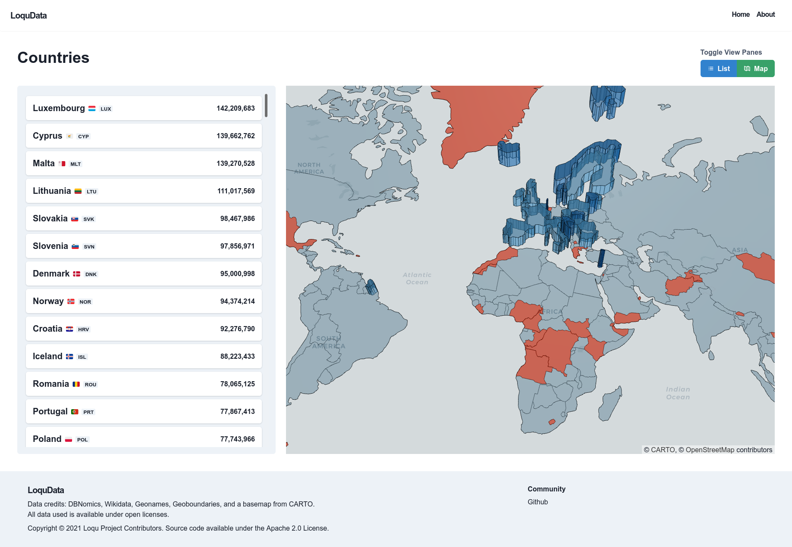

# Loqu Frontend

[Loqu](https://loqudata.org/) is a 100% open source tool for data exploration and visualization, and includes 700 million data series from statistical organizations around the world

Loqu decreases the time between looking for data and starting to analyze it. Now you can avoid trawling through public data catalogs, downloading many CSV files, and then having to load them into a separate tool just to visualize the data.

You can learn more on the [About page](https://github.com/loqudata/docs) or by [reading the paper](https://alexkreidler.github.io/loqu-paper/).

## Screenshots

## License

The source code is available under the Apache 2.0 License. Data is available under the Open Database License.
